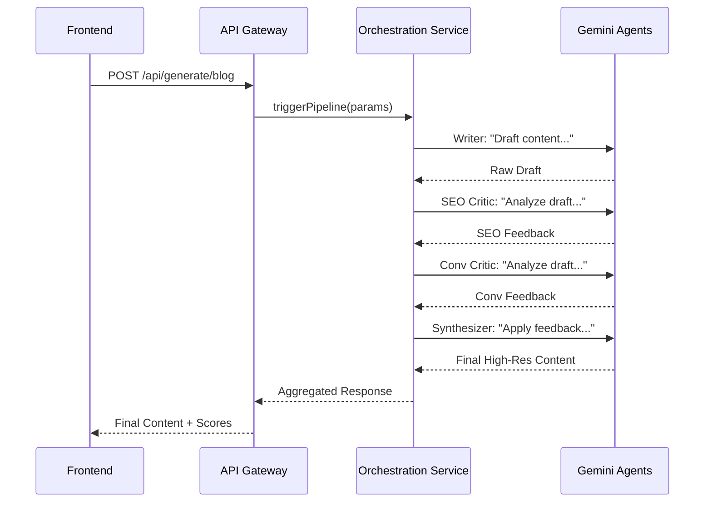

# Product Requirements Document (PRD): Artifex Upgrade

## 1. Vision Statement
Transform Artifex from a basic AI content generator into an **AI-powered Content Strategy & Growth Intelligence Platform**. The system will not only generate text but also critique, optimize, score, and strategize content to maximize growth and conversion metrics.

---

## 2. Product Architecture
Artifex will evolve into a multi-layered intelligence system:
- **Presentation Layer**: A "Glassmorphic" React dashboard (Editorial Studio).
- **Orchestration Layer**: A Node.js/TypeScript backend managing complex multi-agent pipelines.
- **Intelligence Layer**: Multiple specialized Gemini agents working in sequence to refine output.
- **Memory Layer**: PostgreSQL and Prisma storing brand identities, content versions, and topic graphs.

---

## 3. Phased Roadmap

### Phase 1: The Bridge (Core Integration)
- **Goal**: Replace all frontend mock simulations with real backend calls.
- **Logic**: Implement TanStack Query mutations to hit `POST /api/generate/*`.
- **UI**: Real loading spinners and toast notifications for success/error.

### Phase 2: Multi-Agent Generation Pipeline
- **Workflow**:
  1. **Writer Agent**: Creates the initial draft.
  2. **SEO Critic Agent**: Reviews for keywords, headings, and linking.
  3. **Conversion Critic Agent**: Reviews for CTAs, urgency, and emotional triggers.
  4. **Synthesizer Agent**: Merges reflections into a final, polished version.
- **Structured Response**: Return content along with insights from each agent.

### Phase 3: Content Scoring Engine
- **Calculations**: Real-time analysis of Keyword frequency, Flesch Readability, and Conversion signals.
- **Output**: Numeric scores (0-100) and actionable suggestions stored in the DB.

### Phase 4: Version Evolution System
- **Feature**: "Improve With Goal" dropdown (SEO, Clarity, Luxury, etc.).
- **Logic**: Re-runs a specific optimization agent on existing content and stores as a new version.

### Phase 5 & 8: Memory & Insights
- **Brand Memory**: Store tone, personas, and positioning to auto-inject into every prompt.
- **Topic Clustering**: Extract keywords/topics from generations to suggest next content ideas and internal links.

---

## 4. Key Workflows

### 4.1. Intelligent Generation Flow (Backend)

### 4.2. Version Improvement Flow
1. User selects "Improve for SEO".
2. Frontend sends `POST /api/content/:id/improve { mode: 'seo' }`.
3. Backend retrieves Version N, runs SEO Optimization Agent.
4. Backend creates Version N+1.
5. Frontend updates with new content and updated scoring bars.

---

## 5. Backend Logic & Data Requirements
- **Async Execution**: Multi-agent runs may exceed standard HTTP timeout (30s+). Backend will support polling or immediate response if Gemini is fast enough.
- **Schema Updates**:
  - `content_versions`: `version_number`, `improvement_type`, `scores_json`.
  - `brand_profiles`: `tone`, `target_persona`, `banned_words`.
  - `content_topics`: `primary_topic`, `secondary_topics[]`, `keywords[]`.

---

## 6. Frontend Experience (Editorial Studio)
- **Tabs Interface**: Content area will feature tabs: `Edit`, `Optimize`, `Score`, `Versions`, `Insights`.
- **Quality Indicators**: Real-time gauge components showing SEO and Engagement scores.
- **Brand Context**: A "Brand Profile" sidebar to manage the active voice.

---

## 7. Success Criteria
- [ ] Zero mock logic in frontend components.
- [ ] Multi-agent pipeline produces 15% better engagement/SEO scores than single-prompt generation.
- [ ] Content history accurately tracks versions and improvements.
- [ ] Topic clustering suggests semantically relevant content ideas.
- [ ] No regressions in existing authentication or database performance.
